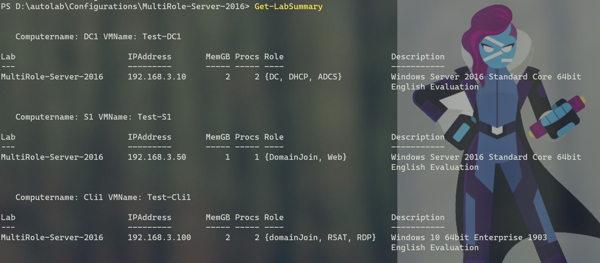

# Detailed Setup Instructions

Please refer to this document to assist in installing and setting up the `PSAutolab` module on your computer. Run all commands from an **elevated** Windows PowerShell session. In other words, *run Windows PowerShell as administrator*. You will know you are elevated if you see the word `Administrator` in the title bar of the PowerShell window. __Do NOT run this module in PowerShell 7__. It is assumed you are running this on Windows 10 Professional or Enterprise editions, or the Windows 11 equivalents.

It is also assumed that you have administrator rights to your computer and can make changes. If your computer is controlled by Group Policy, you may encounter problems. You should also be logged in with a **local** or domain user account. The setup process may not work properly if using an O365 or Microsoft account to logon to Windows.

It is *possible* to run this module with nested virtualization inside a Windows 10 Hyper-V virtual machine but it is **not** recommended. Some networking features may not work properly and overall performance will likely be reduced.

## Pre-Check

You can run these commands to verify your computer meets the minimum requirements. Run all PowerShell commands in an elevated session. If you can't even open a PowerShell prompt, this module definitely won't work on your computer.

### Operating System and Memory

```text
PS C:\> Get-CimInstance -ClassName Win32_OperatingSystem |
Select-Object -property Caption,
@{Name="MemoryGB";Expression={$_.TotalVisibleMemorySize/1mb -as [int]}}

Caption                  MemoryGB
-------                  -----
Microsoft Windows 10 Pro    32
```

If the Caption shows anything other than Pro or Enterprise this module may not work. Although it appears that Windows 10 Education might be supported.

The memory size should be at least 12GB. 16GB or greater is recommended. If the number is less than 12, **STOP**. It is unlikely you have enough installed memory. Depending on the configuration you want to run, it *might* be possible to proceed with less memory. Open an Issue and ask for guidance indicating your memory settings from this command:

```text
PS C:\> Get-CimInstance Win32_OperatingSystem |
Select-Object -property FreePhysicalMemory,TotalVisibleMemorySize

FreePhysicalMemory TotalVisibleMemorySize
------------------ ----------------------
          14357500               33442716
```

Also indicate what lab configuration you are hoping to run.

### Execution Policy

You need to ensure you can run PowerShell scripts on your computer. Run `Get-ExecutionPolicy` to view your current settings. If it shows `Restricted`, then run this command in an elevated PowerShell session.

```powershell
Set-ExecutionPolicy RemoteSigned -force
```

Note, that some organizations may have implemeneted a Group Policy to restrict this setting. If yoiu can't change the policy to something other than `Restricted` you won't be able to use this or any PowerShell module. If the policy is `AllSigned` then you will have to sign the downloaded files with a code signing certificate trusted by your computer. If you are in a corporate environment, you may need to work with your IT department to sort that out.

### PowerShell Remoting

The module relies on Windows PowerShell remoting which should be enabled **before** installing and using this module.

```text
PS C:\> test-wsman

wsmid           : http://schemas.dmtf.org/wbem/wsman/identity/1/wsmanidentity.xsd
ProtocolVersion : http://schemas.dmtf.org/wbem/wsman/1/wsman.xsd
ProductVendor   : Microsoft Corporation
ProductVersion  : OS: 0.0.0 SP: 0.0 Stack: 3.0
```

This is what you should see as a result. Any errors mean that PowerShell remoting is disabled. Enable it from your **elevated** PowerShell session. This will fail if your only network connection is over a public network.

```powershell
Enable-PSRemoting -force
```

If this fails, **STOP**. Do not proceed with this module until this is working and `Test-WSMan` gives you a result. If you are running as Administrator and this command fails it is most likely because the related settings are controlled by a Group Policy or your network is public. Run `Get-NetConnectionProfile` and look at the NetworkCategory for the `LabNet` connection. If must be `Private` or `DomainAuthenticated`.

### Disk Space

The module requires a lot of disk space for the virtual machines, snapshots and ISO files. Run this command to see how much free space you have.

```text
PS C:\> Get-Volume

Drive  SizeGB  FreeGB PercentFree HealthStatus
-----  ------  ------ ----------- ------------
D         477     183       38.41 Healthy
C         237      87       36.71 Healthy
```

You should have close to 100GB of free space on a fixed hard drive such as C or D. The module will setup an Autolab folder on drive C: by default, although you can specify an alternate drive. This module has not been tested running from an externally connected drive.

### Virtualization

The module requires the Hyper-V feature on Windows 10. Please refer to the documentation for your computer hardware to determine if it supports virtualization. You may need to configure settings in your BIOS. You don't need to manually enable the Hyper-V feature now, although you are welcome to if you want to verify it is available.

### Pester

The module uses a standard PowerShell tool called Pester to validate lab configurations. Without getting into technical details, if you are running the out-of-the-box version of Pester on Windows 10, **you need to manually update Pester** before attempting to install this module. In an elevated Windows PowerShell session run this command:

```powershell
Get-Module Pester -ListAvailable
```

If the _only_ result you get is for version `3.4.0`, then you must run:

```powershell
Install-Module pester -RequiredVersion 4.10.1 -Force -SkipPublisherCheck
```

Re-run the `Get-Module` to verify version `4.10.1` is installed. If you have newer versions installed, that will have no effect on this module. Once you have verified Pester version 4.10.1 you can install the PSAutolab module.

## Installation and Configuration

### Install the Module

If you meet the requirements, you are ready to download and install this module. **Do not download anything from this GitHub repository.** In your PowerShell session run this command:

```powershell
Install-Module PSAutolab -force -SkipPublisherCheck
```

You may be prompted to update to a newer version of `nuget`. Answer "yes". You might also be prompted about installing from an untrusted source. Again, you will need to say "yes". After installation you can verify using `Get-Module`.

```text
PS C:\> Get-Module PSAutoLab -list

    Directory: C:\Program Files\WindowsPowerShell\Modules


ModuleType Version    Name                       ExportedCommands
---------- -------    ----                       ----------------
Script     4.19.0      PSAutoLab                 {Enable-Internet, Invoke-RefreshLab, Invoke-Run...
```

You may see a newer version number than what is indicated here. The `README` file in the GitHub repository indicates the current version in the PowerShell Gallery.

### Setup the Host

There is a one-time step to setup your computer for the AutoLab environment. In your elevated PowerShell session run this command:

```powershell
Setup-Host
```

This command will create a directory structure for the module and all of its files. The default is `C:\Autolab` which you should be able to accept. If you are low on space or want to use an alternate drive, then you can specify an alternative top-level path.

```powershell
Setup-Host -DestinationPath D:\Autolab
```

If you select a drive other than C:\ it is recommended you still use the `Autolab` folder name. The setup process will install additional modules and files. If necessary, it will enable the Hyper-V feature. If Hyper-V is enabled during the setup, please reboot your computer before proceeding.

To verify your configuration, run `Get-PSAutolabSetting`.

```text
PS C:\> Get-PSAutoLabSetting

AutoLab                     : C:\Autolab
PSVersion                   : 5.1.18362.752
PSEdition                   : Desktop
OS                          : Microsoft Windows 10 Pro
FreeSpaceGB                 : 365.45
MemoryGB                    : 32
PctFreeMemory               : 59.71
Processor                   : Intel(R) Core(TM) i7-8750H CPU @ 2.20GHz
IsElevated                  : True
RemotingEnabled             : True
NetConnectionProfile        : Private
HyperV                      : 10.0.18362.1
PSAutolab                   : 4.19.0
Lability                    : {0.19.1, 0.19.0, 0.18.0}
Pester                      : {5.0.2, 4.10.1, 4.9.0, 4.8.1...}
PowerShellGet               : 2.2.4.1
PSDesiredStateConfiguration : 1.1
```

If Hyper-V is not installed you will see errors. Any errors indicate a problem with your setup. Please post this information when reporting an issue.

### Setup a Configuration Unattended

In an elevated PowerShell session, **change directory** to the configuration folder that you want to use.

```text
PS C:\> cd C:\Autolab\Configurations\SingleServer-GUI-2016
PS C:\Autolab\Configurations\SingleServer-GUI-2016\>
```

You can look at the `instructions.md` file in the folder to get more information about the configuration.

```text
PS C:\Autolab\Configurations\SingleServer-GUI-2016\> get-content .\Instructions.md
```

Or open the file with Notepad.

Another option is to use the `Get-LabSummary` command. This will show you what computers will be created and how they will be created. The Computername will also be the virtual machine name.



You can run `Unattend-Lab` for a completely hands-free experience.

```text
PS C:\Autolab\Configurations\SingleServer-GUI-2016\> unattend-lab
```

The very first time you setup a lab, the command will download ISO images of evaluation software from Microsoft. These files will be at least 4GB in size. If you are setting up a domain-based configuration, this means you will be downloading ISO images for Windows Server and Windows 10. This download only happens once.

Note that during the validation phase you may see errors. This is to be expected until all of the configurations merge. You can press `Ctrl+C` to break out of the testing. The virtual machines will continue to prepare themselves. Later, you can manually validate the lab:

```text
PS C:\Autolab\Configurations\SingleServer-GUI-2016\> Invoke-Pester .\vmvalidate.test.ps1
```

### Manual Configuration Setup

If you encounter errors running an unattended setup, you should step through the process manually to identify where exactly an error is occurring. Make sure you are in an elevated PowerShell session and you have *changed location to the configuration folder*. If you have tried to setup the lab before run `Wipe-Lab` to remove previous set-up files. Then run each of these commands individually:

* `Setup-Lab`
* `Enable-Internet`
* `Run-Lab`

Errors that affect setup should happen in one of these steps. If so, open an issue with the configuration name, the command you were working on and the error message. Also include the output from `Get-PSAutolabSetting`.

After about 10 minutes, you can run the validation command:

```powershell
Validate-Lab
```

The `Write-Progress` display will provide feedback on the process.

:bulb: Run `Validate-Lab -Verbose` to get details on the process

Beginning with v4.21.0, the validation command will restart virtual machines that have stopped and restart-virtual machines that appear to be failing. You will see this as warning messages. Validation will abort after 65 minutes if it hasn't completed. At which point you can manually test to see if the configuration has converged.

```powershell
Invoke-Pester .\vmvalidate.test.ps1
```

Depending on the error, you might simply ignore it or manually attempt to resolve it. Often the best approach is to run `Wipe-Lab -force` and start all over.

### Help

All of the commands in this module have help and examples. You are also encouraged to read the about help topic.

```powershell
help about_PSAutoLab
```

## Using the Environment Prefix

In the `VMConfigurationData.psd1` file for each lab, you will see a commented out section for an environment prefix value. This value exists for special situations where you might have a virtual machine naming collision or want to be able to identify the virtual machines that belong to the AutoLab module. In a normal setup and for almost all users, the Hyper-V virtual machine name will be the same as the hostname (computer name) in the VM guest. If the lab creates a guest with a computer name of `S1`, the Hyper-V virtual machine will also be called `S1`. If you enable the prefix setting, the Hyper-V virtual machine name will use the prefix, **but the guest computer name will not.**  For example, if you enable the default prefix (you can change it to anything you'd like), you will create a Hyper-V virtual machine with a VMName of `Autolab-S1` but the actual computer name will still be `S1`. The validation tests will reference the guest computer name, not the Hyper-V virtual machine name.

If you must use this feature, open the `VMConfigurationData.psd1` file in a text or code editor. Scroll down to the `NonNodeData` section.

```powershell
NonNodeData = @{
    Lability = @{

        # You can uncomment this line to add a prefix to the virtual machine name.
        # It will not change the guest computer name
        # See https://github.com/pluralsight/PS-AutoLab-Env/blob/master/Detailed-Setup-Instructions.md
        # for more information.

        #EnvironmentPrefix = 'AutoLab-'
```

Remove the `#` character before `EnvironmentPrefix`. If you want to change the value from `Autolab-` to something else go ahead. The prefix will be inserted before the computer name to create the virtual machine name.

This setting should only be used in special situations as it can be confusing. While every effort has been made to ensure compatibility with commands in this module, there is no guarantee of 100% success. Also note that any changes you make to the configuration files could be overwritten in future updates or when you run `Refresh-Host`.

## Troubleshooting Tips

Occasionally, things can go wrong for no apparent reason. If you ran through the manual steps to setup a lab but the validation tests are still failing, you may need to stop and restart the virtual machine that is causing problems. For example, *sometimes* the SRV2 member in the `PowerShellLab` configuration simply won't pass validation, often because it can't be connected to. The best solution is to shut down the virtual machine in either the Hyper-V Manager or from PowerShell.

```powershell
Stop-VM srv2 -force
```

Then start it back up.

```powershell
Start-VM srv2
```

Wait about 5 minutes and then test again.

Another good test is to try an setup another simple configuration. Run `Wipe-Lab -force` from the configuration folder, then change to one of the simple configurations like `SingleServer` or `Windows10` and see if that installs. This will help determine if the problem is isolated to a specific lab configuration or a larger issue with your environment.

### Manually Apply the Configuration

As a last resort, you can try to manually re-apply a configuration to a virtual machine. If you run `Invoke-Pester .\vmvalidate.test.ps1` you be able to discover what virtual machine is failing. For the sake of demonstration let's say it is a virtual machine called WIN10. To re-apply the configuration, you need to create a remoting session to it.

First, you need the lab password to create a credential object.

```powershell
$data = Import-PowerShellDataFile .\VMConfigurationData.psd1
$pass = ConvertTo-SecureString -AsPlainText -String $data.allnodes.labpassword -force
$cred = new-object PSCredential -ArgumentList administrator, $pass
```

Note that if the lab has a mix of domain and workgroup machines, you will need to look at the VMConfigurationData file to discover the correct password. Almost always they will be same.

Next, create a CIMSession to the virtual machine.

```powershell
$cim = New-CimSession -ComputerName win10 -Credential $cred
```

Now, you can apply the DSC configuration. You need run this from the lab configuration folder.

```powershell
Start-DscConfiguration -CimSession $cim -Path . -wait -Force -verbose
```

You will be able to watch the process. Wait a minute or two for any background processing to finish and then test:

```powershell
Test-DscConfiguration -CimSession $cim -Detailed
```

If all goes well, you should see something like this:

```text
PSComputerName  ResourcesInDesiredState        ResourcesNotInDesiredState     InDesiredState
--------------  -----------------------        --------------------------     --------------
win10           {[Registry]TLS, [xIPAddress...                                True
```

If there are resources not in the desired state, wait 10 minutes and test again. If there are still failures, wipe the lab and start all over. At which point, *if you are still having failures*, file an issue and we'll have to determine what is happening.

## Getting Help

If encounter problems getting any of this to work, you are welcome to post an Issue. If you get the module installed, please include the results of `Get-PSAutolabSetting`. If your problem is meeting one of the requirements, we will do our best to help. Although if your computer is locked down or otherwise controlled by corporate policies there may not be much that we can do.
